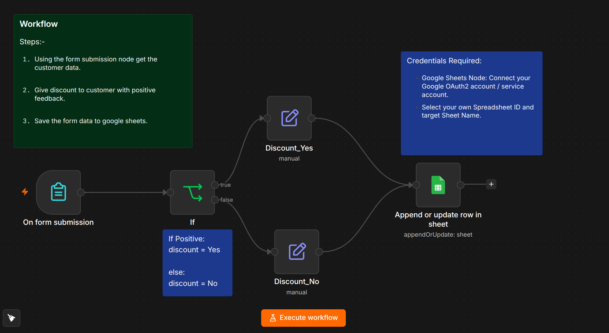

# 🤖 Customer Feedback Automation — n8n Workflow

An automated **n8n workflow** that collects customer information through a form, checks whether the customer has provided positive feedback, and stores the submitted data in **Google Sheets**.

---

## 📌 Features


* 📝 **Customer Data Collection**
  Collects customer information using an n8n Form Submission node.

* 😊 **Feedback Evaluation**
  Checks whether the customer's feedback is positive.

* ✅ **Yes/No Decision**
  Determines whether the customer qualifies based on a simple **Yes / No** response.

* 📊 **Google Sheets Integration**
  Saves the submitted customer information and feedback result to Google Sheets.

* ⚡ **Fully Automated**
  The complete process runs automatically after the form is submitted.

---

## ⚡ Workflow Architecture

```text
┌──────────────────────┐
│   Form Submission    │
│                      │
│  Customer Data       │
│  Name                │
│  Email               │
│  Age                 │
│  Feedback            │
└──────────┬───────────┘
           │
           ▼
┌──────────────────────┐
│  Feedback Evaluation │
│                      │
│  Positive? Yes / No  │
└──────────┬───────────┘
           │
           ▼
┌──────────────────────┐
│    Google Sheets     │
│                      │
│   Save Form Data     │
└──────────────────────┘
```

---

## 🔄 Workflow Steps

### 1. 📝 Get Customer Data

The workflow starts with the **Form Submission** node.

The customer enters their information through the form.

Example fields:

| Field        | Description              |
| ------------ | ------------------------ |
| **Name**     | Customer's name          |
| **Email**    | Customer's email address |
| **Age**      | Customer's age           |
| **Feedback** | Customer feedback        |

The **Age** field is stored as a number.

---

### 2. 😊 Check Positive Feedback

The submitted feedback is evaluated to determine whether it is positive.

The result is represented using a simple **Yes / No** value.

```text
Positive Feedback?
       │
   ┌───┴───┐
   │       │
  Yes      No
   │       │
   └───┬───┘
       │
       ▼
 Google Sheets
```

There is no discount percentage or other numeric reward calculation in this workflow.

---

### 3. 📊 Save Data to Google Sheets

The form submission and feedback result are saved to **Google Sheets**.

Example spreadsheet structure:

| Name     | Email                                       | Age | Feedback          | Positive Feedback |
| -------- | ------------------------------------------- | --- | ----------------- | ----------------- |
| John Doe | [john@example.com](mailto:john@example.com) | 25  | Great experience! | Yes               |
| Jane Doe | [jane@example.com](mailto:jane@example.com) | 32  | Could be better.  | No                |

The **Age** column contains numeric values.

---

## 🧩 Node Configuration

| Step  | Node                | Node Type   | Description                                                                |
| ----- | ------------------- | ----------- | -------------------------------------------------------------------------- |
| **1** | Form Submission     | Trigger     | Collects customer information and feedback.                                |
| **2** | Feedback Evaluation | Logic / AI  | Determines whether the feedback is positive and returns **Yes** or **No**. |
| **3** | Google Sheets       | Integration | Saves the form data and feedback result.                                   |

---

## 🚀 Setup & Installation

### Prerequisites

Before using this workflow, you need:

* An active **n8n** instance

  * n8n Cloud, or
  * Self-hosted n8n
* An **n8n Form**
* A **Google account**
* A **Google Sheets** spreadsheet
* Google Sheets credentials configured in n8n

---

### 1. Import the Workflow

Import the workflow JSON into your n8n workspace.

In n8n:

```text
Workflows → Import from File
```

Select the workflow JSON file.

---

### 2. Configure the Form

Configure the **Form Submission** node with the required fields.

Example:

```text
Name
Email
Age
Feedback
```

The **Age** field should be configured as a number.

---

### 3. Configure Feedback Evaluation

The workflow evaluates the customer's feedback and produces a simple result:

```text
Positive Feedback
        │
        ├── Yes
        │
        └── No
```

The result can then be stored along with the original form data.

---

### 4. Configure Google Sheets

Connect your Google account to the **Google Sheets** node.

Create or select a spreadsheet containing columns such as:

```text
Name
Email
Age
Feedback
Positive Feedback
```

Map the values from the form and feedback evaluation to the corresponding spreadsheet columns.

---

### 5. Activate the Workflow

After configuring the nodes:

1. Save the workflow.
2. Submit a test form.
3. Verify that the feedback evaluation returns **Yes** or **No**.
4. Check that the customer information is correctly stored in Google Sheets.
5. Activate the workflow.

---

## 📤 Example

### Customer Form Submission

```text
Name: John Doe
Email: john@example.com
Age: 25
Feedback: "I really enjoyed the service!"
```

### Workflow Processing

```text
Form Submission
      ↓
Feedback Evaluation
      ↓
Positive Feedback: Yes
      ↓
Google Sheets
```

### Google Sheets Result

```text
Name       | Email             | Age | Feedback                  | Positive Feedback
-----------|-------------------|-----|---------------------------|------------------
John Doe   | john@example.com  | 25  | I really enjoyed service! | Yes
```

---

## 🛠️ Customization

The workflow can be extended based on your requirements.

### 🤖 AI-Based Feedback Analysis

An AI model can be used to analyze the feedback and return:

```text
Yes
```

for positive feedback and:

```text
No
```

for non-positive feedback.

### 📊 Additional Customer Fields

Additional form fields can be added and mapped to Google Sheets if required.

### 🔔 Notifications

The workflow can be extended to send notifications when a customer provides positive feedback.

---

## 🔐 Security

When deploying this workflow:

* Do not commit Google credentials to GitHub.
* Use n8n's built-in credential management.
* Avoid storing API keys directly in workflow nodes.
* Restrict access to customer information and Google Sheets.
* Handle customer data according to applicable privacy and data-protection requirements.

Example `.gitignore`:

```gitignore
.env
credentials.json
*.secret
```

---

## 📁 Suggested Repository Structure

```text
.
├── README.md
├── workflow.json
└── .gitignore
```

---

## 🧠 Use Cases

This workflow can be used for:

* 📝 Customer feedback collection
* 😊 Feedback classification
* 📊 Customer data management
* 🔄 Automated feedback processing
* 📈 Customer experience tracking
* 🤖 AI-powered feedback analysis

---

## ⚠️ Notes

* The feedback result is represented only as **Yes** or **No**.
* There is no discount percentage calculation in this workflow.
* There is no order information or order ID.
* **Age** is treated as a numeric field.
* Test the workflow with sample form submissions before activating it in production.

---

## 📄 License

Add your preferred license here, for example:

```text
MIT License
```

---

## 🙌 Built With

* [n8n](https://n8n.io/)
* n8n Form
* Google Sheets
* Optional AI/LLM integration
